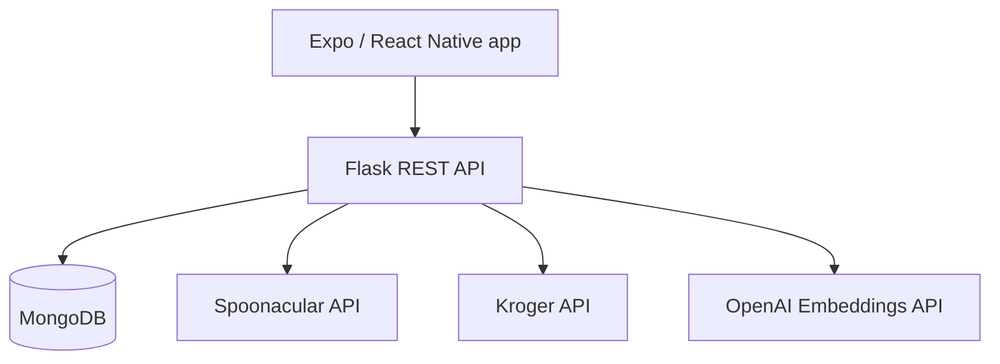

# SmartCart Backend

SmartCart is an academic mobile grocery and recipe-planning application built by a four-person capstone team over approximately four months. It helps users discover recipes, save favorites, apply dietary preferences, and turn meal ideas into a shopping cart.

This repository contains the Flask API and MongoDB persistence layer. The companion Expo/React Native application is in [SmartCart-Frontend](https://github.com/shreyakembhavi/SmartCart-Frontend).

> **Project status:** Capstone prototype. The application was demonstrated through Expo Go and is not currently deployed or production-hardened.

## What SmartCart does

- Authenticates users and supports email-based two-factor verification
- Stores dietary restrictions, intolerances, cuisine choices, and nutrition goals
- Searches and retrieves recipes through Spoonacular
- Saves recipes and persists shopping-cart and order data in MongoDB
- Integrates Kroger product and cart workflows
- Produces personalized recipe recommendations from saved-recipe embeddings
- Supports the team's Quick Pick Cart flow, which scans a grocery-list image in the mobile experience and adds recognized items to a cart

## Architecture



The Flask application is organized into route blueprints and reusable functions. MongoDB collections store users, verification tokens, preferences, saved recipes, cart items, and orders.

## Personalized recommendation engine

The recommendation endpoint combines explicit preferences with a user's saved-recipe history:

1. Load the user's dietary, intolerance, and cuisine preferences.
2. Fetch candidate recipes from Spoonacular using those constraints.
3. Embed each saved recipe title with the OpenAI embeddings API.
4. Average the saved-recipe embeddings into a user taste profile.
5. Embed candidate recipe titles and rank them by cosine similarity to that profile.
6. Return the five highest-scoring recipes.

This implementation is an embeddings-based ranking engine; it does **not** use an SVM. When a user has no saved recipes, the endpoint can still return preference-filtered candidates, but they are not yet personalized by similarity.

### Recommendation endpoint

```http
GET /smart-recommendations
Authorization: Bearer <token>
```

The response includes the ranked recipes and metadata indicating whether saved-recipe personalization was available.

## My contributions

My work focused on product direction, personalization, and the mobile experience:

- Designed and implemented the OpenAI embeddings-based recommendation approach
- Built the saved-recipes experience and preference/filter workflows
- Integrated authentication, profile, dashboard, navigation, and persisted app state
- Designed and refined UI/UX across the Expo/React Native application
- Integrated frontend experiences with backend persistence and APIs
- Tested and fixed routing, state-management, AsyncStorage, and data-persistence issues
- Served as Scrum Master for two month-long sprints, coordinating sprint planning, documentation, feature integration, and team collaboration

Quick Pick Cart OCR was developed as a team feature and is listed as part of the overall product rather than as an individual contribution.

## Technology

- Python and Flask
- MongoDB and PyMongo
- JSON Web Tokens
- OpenAI embeddings and NumPy cosine similarity
- Spoonacular API
- Kroger API
- SMTP email verification
- Expo / React Native companion client

## Local setup

### Prerequisites

- Python 3.10 or newer
- MongoDB
- Spoonacular, Kroger, and OpenAI API credentials
- SMTP credentials if testing two-factor email delivery

### Install and run

```bash
git clone https://github.com/shreyakembhavi/SmartCart-Backend.git
cd SmartCart-Backend

python -m venv .venv
source .venv/bin/activate
pip install -r requirements.txt

cp .env.example .env
python run.py
```

On Windows PowerShell, activate the environment with:

```powershell
.venv\Scripts\Activate.ps1
```

Fill in the values in `.env` before starting the server. Never commit that file or real API credentials.

## Environment variables

| Variable | Purpose |
| --- | --- |
| `MONGODB_URI` | MongoDB connection string |
| `JWT_SECRET_KEY` | Token-signing secret |
| `SMTP_SERVER`, `SMTP_PORT` | Email server configuration |
| `EMAIL_USERNAME`, `EMAIL_PASSWORD` | Email verification credentials |
| `API_KEY` | Spoonacular API key |
| `KROGER_CLIENT_ID`, `KROGER_CLIENT_SECRET` | Kroger API credentials |
| `OPENAI_API_KEY` | Embeddings API credential |
| `RECOMMENDATION_EMBEDDING_MODEL` | Optional embedding model override |

## Selected API areas

| Area | Examples |
| --- | --- |
| Authentication | Registration, login, verification, protected routes |
| Preferences | Diets, intolerances, cuisines, and nutrition goals |
| Recipes | Search, random discovery, details, and ingredient-based lookup |
| Recommendations | Personalized ranking at `/smart-recommendations` |
| Saved recipes | Create, read, and remove saved recipes |
| Shopping | Kroger products, cart items, and orders |

## Prototype limitations

- The project depends on third-party API availability and quotas.
- Recommendations currently embed recipe titles rather than richer ingredient or instruction text.
- Embeddings are generated on demand and are not cached.
- Kroger configuration includes prototype assumptions such as a fixed test location.
- Additional validation, automated tests, observability, rate limiting, and deployment hardening would be needed for production use.
